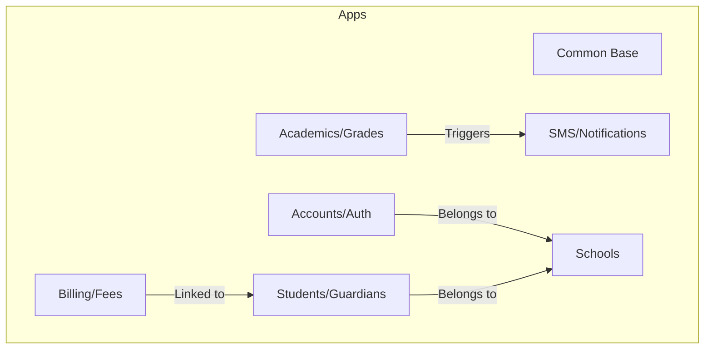

# 📚 TemariLink: School Management SaaS

[](https://www.python.org/)
[](https://www.djangoproject.com/)
[](https://www.django-rest-framework.org/)
[](https://opensource.org/licenses/MIT)

**TemariLink** is a production-level school management system designed for scalability, ease of use, and efficient communication between schools and parents.

---

## ✨ Key Features

- 👤 **Custom User Authentication**: Phone-based authentication with role-based access control (Admin/Teacher).
- 🎓 **Student Management**: Comprehensive student and guardian tracking.
- 📚 **Academic Area**: Manage subjects, terms, and track grades with ease.
- 📩 **Automated SMS Notifications**: Real-time SMS alerts to guardians when new grades are recorded.
- 💰 **Billing System**: Simplified fee tracking and payment management.
- 📄 **Report Generation**: Automatic PDF report card generation for terms.
- 🔌 **RESTful API**: Fully-documented API for frontend integration (React/Next.js ready).

---

## 🏗️ Architecture

TemariLink follows a professional **Modular App Structure**, ensuring separation of concerns and maintainability.



- **Database**: PostgreSQL (Production) / SQLite (Development)
- **Deployment**: Dockerized with Nginx proxy and Gunicorn.
- **Security**: JWT (JSON Web Tokens) for modern frontend authentication.

---

## 🚀 Getting Started

### Prerequisites

- [Docker](https://www.docker.com/) and [Docker Compose](https://docs.docker.com/compose/)
- [Python 3.12](https://www.python.org/downloads/) (for local development)

### Quick Setup (Docker)

1. **Clone the repository**:
   ```bash
   git clone https://github.com/yourusername/temarilink.git
   cd temarilink
   ```

2. **Configure Environment Variables**:
   ```bash
   cp .env.example .env
   # Edit .env with your specific settings
   ```

3. **Build and Run**:
   ```bash
   docker-compose up --build
   ```

The app will be available at `http://localhost:80`.

---

## 🛠️ API Documentation

TemariLink provides a comprehensive set of API endpoints.

| Method | Endpoint | Description |
| :--- | :--- | :--- |
| `POST` | `/api/token/` | Obtain JWT access/refresh tokens. |
| `GET` | `/api/students/` | List students (supports filtering/search). |
| `POST` | `/api/grades/` | Record a new grade (triggers SMS). |
| `GET` | `/api/sms/` | View sent notification logs. |

---

## 🛡️ Best Practices Applied

- **Clean Architecture**: Decoupled business logic via dedicated service layers.
- **Robust API**: Standardized error responses and robust validation.
- **Production Ready**: Optimized multi-stage Docker builds and secure configuration management.

---

## 📜 License

Distributed under the MIT License. See `LICENSE` for more information.

---

## 👨‍💻 Developed by

**Senior-Level Architecture** - Designed for Temarilink.
